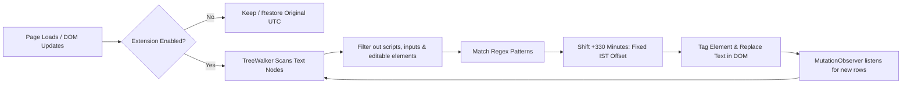

# Cursor IST Time

<div align="center">


### **Real-time UTC to IST Converter for Cursor.com Dashboard**

*A lightweight, privacy-focused Manifest V3 Chrome extension that seamlessly rewrites UTC timestamps on Cursor's dashboard to Indian Standard Time (UTC+5:30) in place.*

[](manifest.json)
[](https://cursor.com)
[](#-privacy--security)
[](#-project-structure)
[](LICENSE)

</div>

---

## 📌 Table of Contents

- [Overview](#-overview)
- [Before & After Showcase](#-before--after-showcase)
- [Key Features](#-key-features)
- [Supported Formats](#-supported-formats)
- [How It Works](#-how-it-works)
- [Installation Guide](#-installation-guide)
- [Verification & Testing](#-verification--testing)
- [Extension Popup](#-extension-popup)
- [Privacy & Security](#-privacy--security)
- [Project Structure](#-project-structure)
- [Packaging for Distribution](#-packaging-for-distribution)
- [Troubleshooting & FAQ](#-troubleshooting--faq)
- [Contributing](#-contributing)
- [License](#-license)

---

## 📖 Overview

The [Cursor](https://cursor.com) dashboard (`/dashboard/usage`, audit logs, and request history) displays all timestamps strictly in **UTC** (Coordinated Universal Time). 

For developers and teams working in **IST (Indian Standard Time)**, calculating `+5 hours 30 minutes` in your head—especially across midnight date boundaries—causes unnecessary friction when monitoring model usage, inspecting request spikes, or verifying monthly quotas.

**Cursor IST Time** runs discreetly in the background, automatically translating UTC dates and times across `cursor.com` into clear, localized IST strings.

---

## ⚡ Before & After Showcase

| Location / Context | Default Cursor Dashboard (UTC) | With Cursor IST Time (IST) |
| :--- | :--- | :--- |
| **Usage Table Row** | `Sep 15, 07:06 PM` | `Sep 16, 12:36 AM IST` *(date rolled forward!)* |
| **Full Date & Time** | `Sep 15, 2026, 07:06 PM` | `Sep 16, 2026, 12:36 AM IST` |
| **Table Column Header** | `Date (UTC)` | `Date (IST)` |
| **ISO Timestamp** | `2026-09-15T19:06:00Z` | `2026-09-16T00:36:00 IST` |
| **Spaced ISO Format** | `2026-09-15 19:06 UTC` | `2026-09-16 00:36 IST` |
| **Chart Hover Tooltip** | `07:06 PM` *(context: Sep 15)* | `12:36 AM IST` |

> [!NOTE]
> All token counts, dollar amounts, usage costs, and model names are strictly preserved and never modified.

---

## ✨ Key Features

- ⚡ **Zero-Latency In-Place Conversion**: Uses targeted DOM `TreeWalker` algorithms to rewrite text nodes directly without inducing layout shifts or page re-renders.
- 🔄 **Instantly Reversible**: Caches original UTC strings on elements (`data-ist-original`). Switching the popup toggle **off** restores the exact original UTC text instantly without a page reload.
- 🚀 **SPA & React Optimized**:
  - Automatically handles client-side route transitions by intercepting HTML5 History API (`pushState`, `replaceState`, and `popstate`).
  - Employs a debounced `MutationObserver` (100ms) to smoothly process dynamically appended table rows, pagination, and Radix UI hover tooltips.
- 🧠 **Smart Year Rollover Engine**: For yearless dates (e.g., `Dec 31, 09:30 PM`), if assuming the current year would land more than 2 days in the future (e.g. reviewing December logs in January), it seamlessly falls back to the previous calendar year.
- 🛡️ **Ultra-Secure & Privacy-First**: 
  - Zero external HTTP requests or remote dependencies.
  - Zero telemetry, tracking, or background analytics.
  - Requires only the minimal `storage` permission to preserve your toggle setting.
- 🎨 **Cursor-Native Aesthetics**: Popup toggle is tailored with a clean, dark-mode design matching Cursor's official design language.

---

## 🕒 Supported Formats

The extension detects and converts multiple timestamp formats used across Cursor's web interfaces:

```
1. Month Day, Year, Time:
   "Sep 15, 2026, 07:06 PM"        --> "Sep 16, 2026, 12:36 AM IST"
   "Sep 15, 2026, 07:06 PM UTC"    --> "Sep 16, 2026, 12:36 AM IST"

2. Month Day, Time (Yearless):
   "Sep 15, 07:06 PM"              --> "Sep 16, 12:36 AM IST"
   "Sep 15, 07:06 PM UTC"          --> "Sep 16, 12:36 AM IST"

3. ISO 8601 Strings:
   "2026-09-15T19:06:00Z"          --> "2026-09-16T00:36:00 IST"
   "2026-09-15T19:06Z"             --> "2026-09-16T00:36 IST"

4. Spaced UTC Dates:
   "2026-09-15 19:06:00 UTC"       --> "2026-09-16 00:36:00 IST"
   "2026-09-15 19:06 UTC"          --> "2026-09-16 00:36 IST"

5. Table Headers:
   "Date (UTC)"                    --> "Date (IST)"

6. Context-Aware Bare Time (Chart Tooltips & Axes):
   "07:06 PM"                      --> "12:36 AM IST" (when anchored to date context)
```

---

## 🛠️ How It Works



1. **Fixed UTC Offset**: IST does not observe Daylight Saving Time (DST). The conversion relies on a constant `OFFSET_MINUTES = 330` (+5 hours 30 minutes).
2. **Safe Traversal**: Skips `<script>`, `<style>`, `<textarea>`, `<input>`, and any `[contenteditable]` elements to guarantee that prompt inputs and code editors are never modified.
3. **Loop Prevention**: Converted elements are marked with `data-ist-converted="1"`, avoiding recursive DOM mutation loops while the `MutationObserver` is active.

---

## 🚀 Installation Guide

Works on any Chromium-based browser (**Google Chrome**, **Brave**, **Arc**, **Microsoft Edge**, **Opera**, **Vivaldi**).

### Load as Unpacked Extension

1. **Clone or download** this repository to your local machine:
   ```bash
   git clone https://github.com/BuildWithSubha/cursor-ist-time.git
   ```
   *(Alternatively, download and extract the ZIP archive).*

2. Open your browser's Extensions page:
   - **Chrome**: Navigate to `chrome://extensions`
   - **Brave**: Navigate to `brave://extensions`
   - **Edge**: Navigate to `edge://extensions`

3. Toggle on **Developer mode** (switch located at the top-right corner).

4. Click the **Load unpacked** button in the top-left toolbar.

5. Select the folder containing `manifest.json` (`cursor-ist-time`).

6. *(Optional)* Click the puzzle piece icon in the browser toolbar and **pin** **Cursor IST Time** for quick access.

---

## 🧪 Verification & Testing

Verify that the extension is operating properly in under a minute:

1. Navigate to [`https://cursor.com/dashboard/usage`](https://cursor.com/dashboard/usage) (ensure you are logged in).
2. Look at the request history or usage logs table:
   - Notice that the table header reads **`Date (IST)`** instead of `Date (UTC)`.
   - Notice timestamps end with **`IST`** and reflect Indian Standard Time.
3. Click the extension icon in your browser toolbar to open the popup:
   - Uncheck **Convert times to IST**. The page will instantly revert all timestamps back to UTC without a reload.
   - Re-check the box. The timestamps immediately convert back to IST.
4. Paginate or scroll down to load additional rows; newly loaded rows convert automatically.

---

## 🎛️ Extension Popup

The extension includes a clean, dark-mode popup menu:

```
+---------------------------------------+
|  [icon]  Cursor IST Time              |
|          UTC +5:30 on cursor.com      |
+---------------------------------------+
|  [X] Convert times to IST             |
|      Rewrites dashboard UTC           |
|      timestamps in place.             |
|                                       |
|  Status: On — UTC timestamps on       |
|  cursor.com are shown in IST.         |
+---------------------------------------+
```

- Preferences are stored in `chrome.storage.sync`, persisting across browser sessions and synchronizing across devices signed into the same browser profile.

---

## 🔒 Privacy & Security

We believe browser extensions should adhere to the highest standard of user privacy:

- **0 Network Requests**: Does not connect to any external server, CDN, or third-party API.
- **Minimal Permissions**: Requests only `"permissions": ["storage"]` to remember your toggle preference.
- **Strict Host Scope**: Active only on `https://cursor.com/*` and `https://www.cursor.com/*`. Cannot read or interact with any other websites.
- **No Analytics / Telemetry**: No tracking pixels, error monitoring services, or fingerprinting.
- **Open Source**: 100% auditable JavaScript with zero obfuscation or minification.

---

## 📂 Project Structure

```
cursor-ist-time/
├── manifest.json       # Chrome Manifest V3 configuration
├── content.js          # DOM observer, parsing engine & IST math
├── popup.html          # Clean popup user interface
├── popup.js            # Preference sync and toggle controller
├── icons/              # Extension icons in standard resolutions
│   ├── icon16.png      # Favicon / context menu size (16x16)
│   ├── icon32.png      # Windows toolbar / popup header (32x32)
│   ├── icon48.png      # Extension management page (48x48)
│   └── icon128.png     # Chrome Web Store & installation (128x128)
└── README.md           # Documentation
```

> **No Build Steps**: Built purely with native Vanilla JavaScript, HTML5, and CSS. No `node_modules`, npm dependencies, or bundlers required.

---

## 📦 Packaging for Distribution

To package the extension into a zip file for distribution or Chrome Web Store submission:

### On Linux / macOS / Git Bash:
```bash
zip -r cursor-ist-time.zip manifest.json content.js popup.html popup.js icons README.md
```

### On Windows PowerShell:
```powershell
Compress-Archive -Path manifest.json, content.js, popup.html, popup.js, icons, README.md -DestinationPath cursor-ist-time.zip -Force
```

---

## ❓ Troubleshooting & FAQ

<details>
<summary><strong>Q: Why aren't timestamps converting on my page?</strong></summary>

1. Ensure the extension toggle is turned **On** in the extension popup.
2. Confirm you are on `https://cursor.com/*` or `https://www.cursor.com/*`.
3. If you just installed or reloaded the extension, refresh any previously open Cursor tabs once so the content script can initialize.
</details>

<details>
<summary><strong>Q: Does this affect token counts or dollar billing calculations?</strong></summary>

**No.** The replacement regex explicitly targets date strings and timestamp structures (`MMM DD, hh:mm A`, ISO 8601, and `Date (UTC)`). Token counts, dollar signs (`$`), model labels (`claude-3.5-sonnet`, `gpt-4o`), and integers are never altered.
</details>

<details>
<summary><strong>Q: Can I turn it off temporarily?</strong></summary>

**Yes.** Simply click the extension icon in your browser toolbar and uncheck **Convert times to IST**. All original UTC timestamps are restored immediately without reloading the page.
</details>

<details>
<summary><strong>Q: Why is IST offset always 5 hours and 30 minutes?</strong></summary>

Indian Standard Time (IST) does not observe Daylight Saving Time (DST). Its UTC offset remains constant at UTC+5:30 year-round.
</details>

---

## 🤝 Contributing

Contributions, bug reports, and suggestions are welcome!

1. **Fork** the repository.
2. **Create a branch** for your feature or bugfix:
   ```bash
   git checkout -b feature/awesome-feature
   ```
3. **Commit** your changes:
   ```bash
   git commit -m "Add support for format X"
   ```
4. **Push** to your fork:
   ```bash
   git push origin feature/awesome-feature
   ```
5. Open a **Pull Request**.

---

## 📄 License

This project is licensed under the [MIT License](LICENSE). Feel free to use, modify, and distribute it.

---

<div align="center">

Crafted with care by [Subha](https://github.com/BuildWithSubha) • Built for developers using [Cursor](https://cursor.com)

</div>
